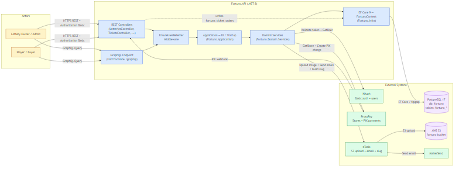

# Fortuno — Plataforma SaaS de loterias online


## Overview

**Fortuno** é uma plataforma backend em .NET 8 para criação e operação de loterias / sorteios online. Donos de loja publicam loterias, jogadores compram bilhetes via PIX (com QR Code emitido pelo gateway parceiro), o sistema sorteia ganhadores, paga comissões para indicadores e processa estornos quando necessário. O backend expõe **REST + GraphQL**, autentica via **NAuth** (Basic token), processa pagamentos via **ProxyPay** e armazena imagens/envia e-mails via **zTools**.

O Fortuno integra um ecossistema de microserviços compartilhados: **NAuth** cuida de identidade/ACL multi-tenant, **ProxyPay** cuida de Stores e cobranças PIX, **zTools** cuida de upload S3 + e-mail (MailerSend) + slugs. As lacunas conhecidas dos parceiros estão registradas em [`docs/EXTERNAL_DEPS_INSTRUCTIONS.md`](docs/EXTERNAL_DEPS_INSTRUCTIONS.md).

A arquitetura segue **Clean Architecture** estrita (regras em `.specify/memory/constitution.md`): Domain isolado, DI centralizada em `Fortuno.Application/Startup.cs`, EF Core como único ORM permitido, snake_case obrigatório no PostgreSQL.

---

## 🚀 Features

- 🎟️ **Loterias** — Criação em `Draft`, publicação, edição de combos de desconto, cancelamento com motivo, listagem pública (`/lotteries/open`).
- 💳 **Compra de bilhetes via PIX** — Reserva de números, geração de QR Code (ProxyPay) e finalização via webhook de pagamento, com persistência em `fortuna_ticket_orders`.
- 🎰 **Sorteios e ganhadores** — Workflow `Raffle` com preview/confirm de ganhadores, fechamento e cancelamento.
- 💰 **Programa de indicações** — `UserReferrer` com código gerado automaticamente no primeiro acesso autenticado (alfabeto sem `I/O` para evitar ambiguidade), comissionamento configurável por loteria.
- ↩️ **Estornos auditados** — `RefundLog` rastreia mudanças de status com motivo e ator.
- 🧠 **GraphQL com projeções** — HotChocolate com `AddProjections + AddFiltering + AddSorting` para queries flexíveis sobre `Lottery`, `Raffle`, `Ticket` e ganhadores.
- 🛡️ **Multi-tenant** — NAuth + ProxyPay separados por tenant (`fortuna`); cada Store pertence a um único usuário admin.
- 🧪 **Cobertura ≥ 80% em CI** — Gate aplicado em `Fortuno.Domain` + `Application` + `Infra` (excluindo Migrations/Repository/Settings).

---

## 🛠️ Technologies Used

### Core Framework
- **.NET 8.0 / C# 12** — Runtime e linguagem (`Directory.Build.props`).
- **ASP.NET Core 8 (Web API)** — Controllers REST + Swashbuckle.
- **HotChocolate** — Endpoint GraphQL em `/graphql` (projections, filtering, sorting).

### Database
- **PostgreSQL 17** — Banco relacional, schema `snake_case`, prefixo `fortuna_*`.
- **Entity Framework Core 9.x + Npgsql** — ORM com `EnableLegacyTimestampBehavior=true` (schema usa `timestamp without time zone`).

### Security
- **NAuth** (`NAuth` v0.5.10) — Basic token authentication, ACL multi-tenant, `IUserClient`/`IRoleClient`, `TenantDelegatingHandler`.
- **`[Authorize]` por padrão** — Endpoints públicos exigem `[AllowAnonymous]` explícito (ex.: `GET /lotteries/open`, `GET /lotteries/{id}`).
- **CORS configurável** — `AllowAnyOrigin` permitido apenas em `Development`.

### Additional Libraries
- **FluentValidation 11** — Validação automática de DTOs (`AddFluentValidationAutoValidation`, scan de assembly).
- **Swashbuckle 8** — OpenAPI/Swagger UI em `/swagger` (apenas em Development).
- **zTools 0.3.8** — Cliente HTTP tipado para upload S3, e-mail MailerSend e geração de slug.
- **Flurl.Http 4** — Cliente HTTP usado nos testes de integração.

### Testing
- **xUnit 2.5** + **FluentAssertions 6.12** + **Moq 4.20** — Unit tests (`Fortuno.Tests`).
- **Coverlet** + **ReportGenerator** — Cobertura cobertura, gate de 80% em CI.
- **Flurl.Http** — Integration tests HTTP-only contra a API rodando (`Fortuno.ApiTests`), sem acesso direto ao banco.

### DevOps
- **Docker / Docker Compose** — `Dockerfile` multi-stage e `docker-compose.yml` (API + PostgreSQL local) / `docker-compose-prod.yml` (somente API, DB externo).
- **GitHub Actions** — Coverage gate (`coverage-check.yml`), tag automática (`version-tag.yml`), release (`create-release.yml`), deploy SSH para servidor de produção (`deploy-prod.yml`).
- **GitVersion** — Versionamento semântico baseado em tags (`GitVersion.yml`).
- **Spec-Kit** — Fluxo `/speckit.specify → clarify → plan → tasks → implement` em `.specify/`.

---

## 📁 Project Structure

```
Fortuno/
├── Fortuno.API/                  # ASP.NET Core (Controllers, GraphQL endpoint, Middleware, Validators)
│   ├── Controllers/              # 9 controllers REST (Lotteries, Tickets, Raffles, ...)
│   ├── Middlewares/              # EnsureUserReferrerMiddleware (gera ReferralCode no 1º acesso)
│   ├── Validators/               # FluentValidation por DTO
│   ├── Program.cs                # Bootstrap (DI + auth + CORS + Swagger + handler global)
│   └── appsettings.*.json        # Development / Docker / Production
├── Fortuno.GraphQL/              # HotChocolate Query + Types (Lottery/Raffle/Ticket/RaffleWinner)
├── Fortuno.Application/          # Composição da DI — Startup.AddFortuno (única classe pública)
├── Fortuno.Domain/               # Models POCO + Interfaces + Services + Enums (sem dep. de Infra)
│   ├── Models/                   # 13 entidades (Lottery, Ticket, Raffle, NumberReservation, ...)
│   ├── Interfaces/               # Contratos de domínio (ILotteryService, IRaffleService, ...)
│   └── Services/                 # Implementações (LotteryService, TicketService, RefundService, ...)
├── Fortuno.Infra/                # FortunoContext + Repositories + AppServices + Migrations EF
│   ├── Context/FortunoContext.cs # Mapeamento Fluent API completo (snake_case, PK/FK nomeadas)
│   ├── Migrations/               # 7 migrations (InitialSchema → AddLotteryStoreClientId)
│   ├── Repository/               # Repositórios concretos sobre Repository<TModel> base
│   └── AppServices/              # NAuthAppService, ProxyPayAppService, ZToolsAppService
├── Fortuno.Infra.Interfaces/     # IRepository<T>, contratos por entidade, contratos de AppService
├── Fortuno.DTO/                  # DTOs Info/InsertInfo/UpdateInfo + Settings (IOptions) + Common
├── Fortuno.Tests/                # Unit tests (Domain/Application/Infra) — coverlet.runsettings
├── Fortuno.ApiTests/             # API tests (HTTP) com fixture compartilhada via xUnit Collection
├── bruno/                        # Coleção HTTP (Bruno) para chamadas manuais
├── docs/                         # Mermaid + docs operacionais e de migração (frontend)
├── specs/                        # Specs Spec-Kit (001-lottery-saas, 002-qa-test-suite, 003-ticket-qrcode-purchase)
├── .specify/memory/constitution.md   # Regras obrigatórias do projeto
├── .claude/skills/               # Skills de geração de código (dotnet-architecture, dotnet-test, ...)
├── .github/workflows/            # CI/CD (4 workflows)
├── docker-compose.yml            # Local: API + Postgres
├── docker-compose-prod.yml       # Produção: somente API (DB externo)
├── Dockerfile                    # Build multi-stage (sdk:8.0 → aspnet:8.0)
├── fortuno.sql                   # Snapshot SQL do schema atual (referência)
├── Fortuno.sln                   # Solution com 8 projetos
└── README.md                     # Este arquivo
```

### Ecossistema (microserviços externos)

| Projeto | Tipo | Tenant Fortuno | Descrição |
|---------|------|----------------|-----------|
| **NAuth** | Microserviço HTTP | `fortuna` | Identidade, ACL, Basic token, JWT secret compartilhado. |
| **ProxyPay** | Microserviço HTTP | `fortuno` | Cadastro de Stores, cobranças PIX, webhooks de pagamento. |
| **zTools** | Microserviço HTTP | (sem multi-tenant) | Upload S3 (`ZTools__S3BucketName`), e-mail (MailerSend), slug. |

#### Grafo de dependências entre projetos

```
                     ┌──────────────┐
                     │  Fortuno.API │
                     └──────┬───────┘
                            │
           ┌────────────────┼─────────────────┐
           ▼                ▼                 ▼
   ┌──────────────┐ ┌────────────────┐  ┌──────────────┐
   │ Fortuno.GQL  │ │Fortuno.App     │  │  Fortuno.DTO │
   └──────┬───────┘ │ (DI Startup)   │  └──────────────┘
          │         └───────┬────────┘
          │                 │
          ▼                 ▼
   ┌──────────────┐  ┌─────────────┐  ┌──────────────────────┐
   │Fortuno.Domain│◀─│Fortuno.Infra│─▶│Fortuno.Infra.Interfaces│
   └──────────────┘  └─────────────┘  └──────────────────────┘
```

---

## 🏗️ System Design

O diagrama abaixo ilustra a arquitetura de alto nível do **Fortuno**:



**Atores** (Lottery Owner, Player) chamam REST/GraphQL com `Authorization: Basic`. O `EnsureUserReferrerMiddleware` garante que todo usuário autenticado tenha um `UserReferrer` antes de qualquer handler. Domain Services consomem NAuth (validação de token + dados de usuário), ProxyPay (Store ownership + cobranças PIX) e zTools (S3 + e-mail + slug). Webhooks de pagamento do ProxyPay voltam para a própria API e materializam linhas em `fortuna_ticket_orders` via EF Core.

> 📄 **Source:** o `.mmd` editável está em [`docs/system-design.mmd`](docs/system-design.mmd).

---

## 📖 Additional Documentation

| Documento | Descrição |
|-----------|-----------|
| [EXTERNAL_DEPS_INSTRUCTIONS](docs/EXTERNAL_DEPS_INSTRUCTIONS.md) | Lacunas identificadas em NAuth/ProxyPay/zTools que precisam ser implementadas pelos times parceiros (endpoint em lote, multi-tenant em ProxyPay, etc.). |
| [FRONTEND_STORE_TRANSPARENT_MIGRATION](docs/FRONTEND_STORE_TRANSPARENT_MIGRATION.md) | Guia de migração do frontend para o modelo "Store transparente" introduzido em `003-ticket-qrcode-purchase` (3 quebras de contrato). |
| [FRONTEND_TICKET_NUMBER_FORMAT_MIGRATION](docs/FRONTEND_TICKET_NUMBER_FORMAT_MIGRATION.md) | Guia de migração do frontend para o novo formato de número de ticket e faixas por `NumberType`. |
| `.specify/memory/constitution.md` | Constituição obrigatória do projeto (skills, stack fixa, convenções, autenticação). |
| `specs/001-lottery-saas/` | Spec inicial da plataforma de loteria. |
| `specs/002-qa-test-suite/` | Spec da suíte de QA / API tests. |
| `specs/003-ticket-qrcode-purchase/` | Spec da compra de bilhete via QR Code PIX. |

---

## ⚙️ Environment Configuration

### 1. Copiar o template

```bash
cp .env.example .env
```

### 2. Editar `.env`

```bash
# App
APP_PORT=5000
ASPNETCORE_ENVIRONMENT=Docker

# Database (consumido por docker-compose.yml)
POSTGRES_USER=fortuno
POSTGRES_PASSWORD=your_secure_password_here_change_this
POSTGRES_DB=fortuno
FORTUNO_CONNECTION_STRING=Host=postgres;Port=5432;Database=fortuno;Username=fortuno;Password=your_secure_password_here_change_this

# NAuth (microserviço externo, tenant "fortuna")
NAUTH_API_URL=http://nauth-api:80
NAUTH_TENANT_ID=fortuna
NAUTH_JWT_SECRET=your_jwt_secret_min_64_chars_change_this_change_this_change_this
NAUTH_BUCKET_NAME=

# ProxyPay (tenant "fortuno")
PROXYPAY_API_URL=http://proxypay-api:80
PROXYPAY_TENANT_ID=fortuno

# zTools
ZTOOLS_API_URL=http://ztools-api:8080
ZTOOLS_S3_BUCKET_NAME=fortuno-docker

# CORS — true SOMENTE em Development
CORS_ALLOW_ANY_ORIGIN=false
```

Para produção use `.env.prod.example` como base — nele só vivem segredos (`FORTUNO_CONNECTION_STRING`, `FORTUNO_JWT_SECRET`); valores não-secretos (URLs base, tenant, bucket) ficam em `Fortuno.API/appsettings.Production.json`.

⚠️ **IMPORTANTE**:
- Nunca comitar `.env` ou `.env.prod` com credenciais reais — apenas os `*.example`.
- `NAUTH_JWT_SECRET` deve ter no mínimo 64 caracteres e ser idêntico ao do NAuth do tenant `fortuna`.
- A constituição (§II) **proíbe** rodar `docker` ou `docker compose` no ambiente local de desenvolvimento dos contribuidores — os comandos abaixo aplicam-se a operação/CI.

---

## 🐳 Docker Setup

### Quick Start com Docker Compose

#### 1. Pré-requisitos

```bash
# A rede 'emagine-network' é externa (compartilhada com NAuth/ProxyPay/zTools).
docker network inspect emagine-network >/dev/null 2>&1 \
  || docker network create emagine-network
```

#### 2. Build e start

```bash
docker compose --env-file .env up -d --build
```

#### 3. Verificar deployment

```bash
docker compose ps
docker compose logs -f api
curl -s http://localhost:5000/lotteries/open   # smoke test (rota pública)
```

### Acessando a aplicação

| Serviço | URL |
|---------|-----|
| **API REST** | `http://localhost:5000/` |
| **Swagger UI** | `http://localhost:5000/swagger` (apenas em Development) |
| **GraphQL** | `http://localhost:5000/graphql` |
| **PostgreSQL** | `localhost:5432` (db `fortuno`) |

### Comandos Docker Compose

| Ação | Comando |
|------|---------|
| Iniciar | `docker compose --env-file .env up -d` |
| Iniciar com rebuild | `docker compose --env-file .env up -d --build` |
| Parar | `docker compose stop` |
| Status | `docker compose ps` |
| Logs em tempo real | `docker compose logs -f` |
| Remover containers | `docker compose down` |
| Remover containers + volumes (⚠️ apaga DB local) | `docker compose down -v` |

---

## 🔧 Manual Setup (sem Docker)

### Pré-requisitos

- **.NET SDK 8.0** (instalável via [dotnet.microsoft.com](https://dotnet.microsoft.com/download))
- **PostgreSQL 17** rodando localmente (ou via Docker)
- Acesso a instâncias **NAuth**, **ProxyPay** e **zTools** (locais ou de homologação)

### Passos

#### 1. Restaurar dependências e compilar

```bash
dotnet restore Fortuno.sln
dotnet build Fortuno.sln -c Debug
```

#### 2. Configurar connection string

Edite `Fortuno.API/appsettings.Development.json` (ou exporte `ConnectionStrings__FortunoContext`) apontando para o seu Postgres local:

```json
"ConnectionStrings": {
  "FortunoContext": "Host=localhost;Database=fortuno_dev;Username=fortuno;Password=fortuno;Include Error Detail=true"
}
```

#### 3. Aplicar migrations

```bash
dotnet ef database update --project Fortuno.Infra --startup-project Fortuno.API
```

#### 4. Rodar a API

```bash
dotnet run --project Fortuno.API
# Swagger:  https://localhost:{port}/swagger
# GraphQL:  https://localhost:{port}/graphql
```

#### 5. (opcional) Criar nova migration

```bash
dotnet ef migrations add NomeDaMigration \
    --project Fortuno.Infra --startup-project Fortuno.API
```

---

## 🧪 Testing

### Rodando os testes

**Todos os unit tests:**

```bash
dotnet test Fortuno.Tests/Fortuno.Tests.csproj
```

**Um único teste/classe** (xUnit usa filter `FullyQualifiedName`):

```bash
dotnet test Fortuno.Tests/Fortuno.Tests.csproj \
    --filter "FullyQualifiedName~LotteryServiceTest"
```

**Com cobertura** (mesmo runsettings do CI, gate 80%):

```bash
dotnet test Fortuno.Tests/Fortuno.Tests.csproj \
    --settings Fortuno.Tests/coverlet.runsettings \
    --collect:"XPlat Code Coverage" \
    --results-directory ./coverage-raw

reportgenerator \
    -reports:"./coverage-raw/**/coverage.cobertura.xml" \
    -targetdir:./coverage-report \
    -reporttypes:"TextSummary;HtmlSummary"
```

**API tests** (HTTP-only contra a API rodando — copiar o template de configuração e prover credenciais NAuth válidas):

```bash
cp Fortuno.ApiTests/appsettings.Tests.example.json \
   Fortuno.ApiTests/appsettings.Tests.json   # ou exportar FORTUNO_TEST_*
dotnet test Fortuno.ApiTests/Fortuno.ApiTests.csproj
```

### Estrutura de testes

```
Fortuno.Tests/
├── Domain/Services/        # Testes de domain services (puros, com mocks)
├── Application/Validations/ # Testes de FluentValidation
└── Infra/AppServices/      # Testes de wrappers de microserviços externos

Fortuno.ApiTests/
├── _Fixtures/              # ApiSessionFixture (login NAuth + descoberta de StoreId via ProxyPay)
├── _Smoke/                 # Smoke tests de autenticação
├── Lotteries/              # Lottery REST contracts
├── Tickets/                # Ticket reserve / QR code / status
├── Raffles/                # Raffle workflow
├── RaffleAwards/           # Awards CRUD
├── LotteryCombos/          # Combos de desconto
└── LotteryImages/          # Upload e listagem
```

---

## 📚 API Documentation

A documentação interativa completa fica em `/swagger` (Swagger UI) quando o ASP.NET Core Environment é `Development`. O endpoint **GraphQL** fica em `/graphql` (Banana Cake Pop habilitado em dev).

### Fluxo de autenticação

```
1. POST /user/loginWithEmail no NAuth (X-Tenant-Id: fortuna)
   ↓
2. NAuth devolve { token: "..." }
   ↓
3. Cliente chama Fortuno com Authorization: Basic {token} + X-Tenant-Id: fortuna
   ↓
4. EnsureUserReferrerMiddleware garante UserReferrer na 1ª requisição
   ↓
5. Controller / Domain Service processam a request
```

### Endpoints principais

| Método | Endpoint | Descrição | Auth |
|--------|----------|-----------|------|
| GET    | `/lotteries/open` | Lista loterias públicas (smoke test do deploy). | Não |
| GET    | `/lotteries/{lotteryId}` | Detalhe de loteria. | Não |
| GET    | `/lotteries/slug/{slug}` | Detalhe por slug público. | Não |
| POST   | `/lotteries` | Cria loteria em `Draft`. | Sim |
| GET    | `/lotteries/mine` | Loterias do usuário autenticado. | Sim |
| PUT    | `/lotteries/{lotteryId}` | Edita loteria. | Sim |
| POST   | `/lotteries/{lotteryId}/publish` | Publica loteria. | Sim |
| POST   | `/tickets/reserve-number` | Reserva número de bilhete. | Sim |
| POST   | `/tickets/qrcode` | Gera QR Code PIX (cria `TicketOrder`). | Sim |
| GET    | `/tickets/qrcode/{invoiceId}/status` | Status da cobrança PIX. | Sim |
| GET    | `/tickets/mine` | Bilhetes do usuário autenticado. | Sim |
| GET    | `/tickets/{ticketId}` | Detalhe do bilhete. | Sim |
| POST   | `/raffles` | Cria sorteio dentro de uma loteria. | Sim |
| POST   | `/raffles/{raffleId}/winners/preview` | Sorteio em modo preview. | Sim |
| POST   | `/raffles/{raffleId}/winners/confirm` | Confirma ganhadores. | Sim |
| POST   | `/raffles/{raffleId}/close` | Fecha sorteio. | Sim |
| POST   | `/raffles/{raffleId}/cancel` | Cancela sorteio. | Sim |
| GET    | `/referrals/me` | Comissões do usuário. | Sim |
| GET    | `/referrals/code/me` | Código de indicação do usuário. | Sim |
| POST   | `/refunds/...` | Workflow de estorno (`RefundLog`). | Sim |
| POST   | `/graphql` | GraphQL com projections/filtering/sorting. | Sim |

A coleção [`bruno/`](bruno/) contém requisições prontas para todos os endpoints (use o cliente [Bruno](https://www.usebruno.com/)).

### Formato de resposta padrão (erros)

```json
{
  "sucesso": false,
  "mensagem": "Mensagem amigável em português",
  "erros": ["detalhe 1", "detalhe 2"]
}
```

Chaves portuguesas (`sucesso`, `mensagem`, `erros`) são obrigatórias no `ApiResponse`. Bodies de sucesso seguem `camelCase`.

---

## 🔒 Security Features

### Autenticação e autorização
- **Basic token via NAuth** — Validação por `NAuthHandler` registrado no DI; controllers anotados com `[Authorize]` por padrão.
- **Endpoints públicos explícitos** — Apenas listagem pública e leitura por slug/id usam `[AllowAnonymous]`.
- **Multi-tenant isolado** — Header `X-Tenant-Id` propagado a NAuth/ProxyPay; `StoreOwnershipGuard` valida ownership via ProxyPay antes de mutações.

### Defesa em profundidade
- **CORS controlado** — `AllowAnyOrigin=true` permitido apenas em Development; produção usa `Cors__AllowedOrigins` whitelist.
- **Handler global de exceções** — Garante que stack traces nunca vazem para o cliente; resposta padronizada `ApiResponse.Fail`.
- **`Include Error Detail` apenas em dev** — Connection string de produção não expõe detalhes de erro do Npgsql.
- **`ClientSetNull` por padrão** — Nenhuma migration usa `Cascade` exceto onde explicitamente documentado (ex.: `LotteryImages`), prevenindo deleções acidentais em produção.

---

## 🚀 Deployment

### Ambiente local (development)

```bash
dotnet run --project Fortuno.API   # consome appsettings.Development.json
```

### Ambiente de produção

Deploy é realizado pelo workflow [`.github/workflows/deploy-prod.yml`](.github/workflows/deploy-prod.yml) (gatilho `workflow_dispatch`), que via SSH:

1. Clona ou atualiza o repositório em `/opt/fortuno` no servidor.
2. Injeta `FORTUNO_CONNECTION_STRING` e `FORTUNO_JWT_SECRET` (de GitHub Secrets) em `.env.prod`.
3. Garante a Docker network externa `emagine-network`.
4. Roda `docker compose --env-file .env.prod -f docker-compose-prod.yml up --build -d`.
5. Smoke test: `curl http://fortuno-api:80/lotteries/open` deve devolver `200`.

Sobe **apenas o container `fortuno-api`** — Postgres é externo; URLs base, tenant e bucket vivem em `appsettings.Production.json`.

---

## 🔄 CI/CD

Workflows em [`.github/workflows/`](.github/workflows/):

| Workflow | Gatilho | O que faz |
|----------|---------|-----------|
| **`coverage-check.yml`** | `push` em `main` / `002-**` e `pull_request` para `main` | Build Release de `Fortuno.Tests`, roda unit tests com coverlet, gera relatório com ReportGenerator e **falha se cobertura de linha ficar abaixo de 80%**. Artefato de cobertura é publicado. |
| **`version-tag.yml`** | `push` em `main` + `workflow_dispatch` | Cria tag de versão semântica via GitVersion. |
| **`create-release.yml`** | `workflow_run` após `Version and Tag` | Cria release no GitHub a partir da tag gerada. |
| **`deploy-prod.yml`** | `workflow_dispatch` | Pipeline de 6 jobs (checkout → inject-secrets → network-setup → stop-services → build-deploy → health-check → summary). |

---

## 🤝 Contributing

Contribuições são bem-vindas, mas **devem aderir à constituição do projeto** (`.specify/memory/constitution.md`).

### Setup de desenvolvimento

1. Fork do repositório
2. Crie um branch de feature (`git checkout -b 00X-nome-da-feature`)
3. Para mudanças não triviais, siga o fluxo Spec-Kit: `/speckit.specify` → `/speckit.clarify` → `/speckit.plan` → `/speckit.tasks` → `/speckit.implement`
4. Implemente seguindo as skills obrigatórias (`dotnet-architecture`, `dotnet-test`, `dotnet-test-api`)
5. Rode os testes: `dotnet test Fortuno.Tests/Fortuno.Tests.csproj`
6. Garanta cobertura ≥ 80% nas camadas Domain/Application/Infra
7. Commit (`git commit -m 'feat: descrição curta'`) — mensagens em português ou inglês
8. Push (`git push origin 00X-nome-da-feature`) e abra um Pull Request

### Coding standards (resumo da constituição)

- **Skills obrigatórias** — `dotnet-architecture` para entidades/services/repositories/migrations.
- **Stack fixa** — .NET 8 + EF Core 9 + PostgreSQL. **Não** introduzir ORMs alternativos (Dapper, NHibernate).
- **Convenções .NET** — `PascalCase` em classes/métodos/propriedades; `_camelCase` em campos privados; namespaces file-scoped.
- **Convenções PostgreSQL** — `snake_case` em tabelas/colunas, PK `{entidade}_id bigint identity`, FK `fk_{pai}_{filho}`, `OnDelete(ClientSetNull)`.
- **DTOs** — `[JsonPropertyName("camelCase")]` em todas as propriedades; nomes terminam em `Info`, `InsertInfo`, `UpdateInfo` ou `Result`.
- **DI centralizada** — sempre em `Fortuno.Application/Startup.cs`.
- **`[Authorize]` em controllers com dado sensível**; `[AllowAnonymous]` apenas onde explicitamente público.
- **Não rodar `docker` localmente** — Docker só em CI/produção.

PRs que violarem qualquer item devem justificar na seção "Complexity Tracking" do plano Spec-Kit; revisores **devem** rejeitar caso contrário.

---

## 👨‍💻 Author

Desenvolvido por **[Emagine](https://github.com/emaginebr)**.

---

## 📄 License

Este projeto é licenciado sob a **MIT License** — veja o arquivo [LICENSE](LICENSE) para detalhes.

---

## 🙏 Acknowledgments

- Built with [.NET 8](https://dotnet.microsoft.com/) and [ASP.NET Core](https://learn.microsoft.com/aspnet/core/)
- ORM by [Entity Framework Core](https://learn.microsoft.com/ef/core/) + [Npgsql](https://www.npgsql.org/)
- GraphQL powered by [HotChocolate](https://chillicream.com/docs/hotchocolate)
- Validation via [FluentValidation](https://fluentvalidation.net/)
- API docs via [Swashbuckle](https://github.com/domaindrivendev/Swashbuckle.AspNetCore)
- Auth & ACL by **NAuth** | Payments by **ProxyPay** | Files/email by **zTools**
- Spec-driven development com [Spec-Kit](https://github.com/github/spec-kit)

---

## 📞 Support

- **Issues**: [GitHub Issues](https://github.com/emaginebr/Fortuno/issues)
- **Pull Requests**: [GitHub PRs](https://github.com/emaginebr/Fortuno/pulls)

---

**⭐ Se este projeto for útil para você, considere dar uma estrela no repositório!**
