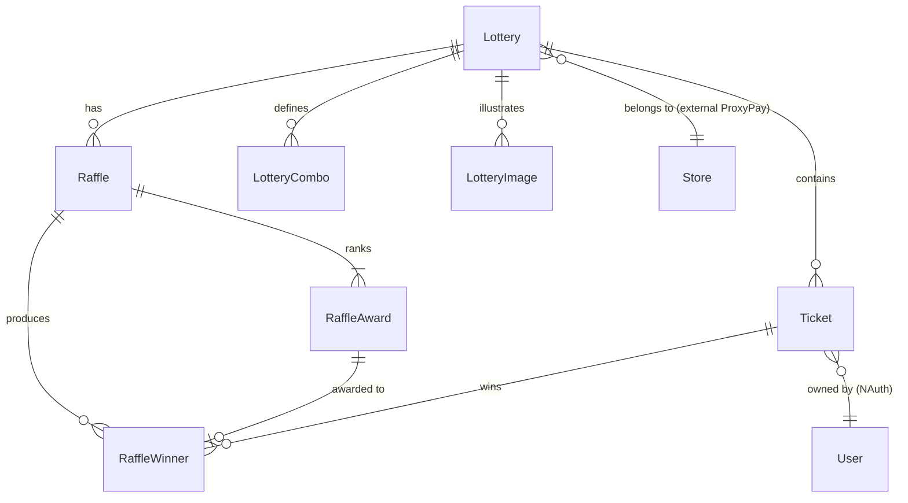

# Phase 1 — Data Model

**Feature**: 002-qa-test-suite
**Date**: 2026-04-18

Esta feature **não cria** nenhuma entidade nova. Os testes exercitam entidades de produção já definidas em `Fortuno.Domain/Models/**`. Este documento registra os atributos, regras e transições **necessários ao comportamento dos testes**; detalhes irrelevantes para a suite (ex.: colunas de log ou auditoria que não afetam cenário) são omitidos.

---

## Entidades exercitadas

### Lottery (coberta por ApiTests + Unit)

| Campo | Tipo | Observações |
|---|---|---|
| `LotteryId` | `long` (PK) | Gerado pela API na criação |
| `StoreId` | `long` (FK conceitual → ProxyPay) | Entrada obrigatória; validada pelo `StoreOwnershipGuard` |
| `Name` | `string` | Sufixado por `UniqueId` nos ApiTests |
| `Slug` | `string` | Gerado via `SlugService` a partir de `Name`; único por Store |
| `Status` | `LotteryStatus` enum | Ver transições abaixo |
| `TicketPrice` | `decimal` | > 0; usado por validator |
| `NumberType` | `NumberType` enum | `Int64`, `Composed3`…`Composed8` |
| `CreatedAt`, `UpdatedAt` | `timestamp` | Gerados pelo servidor |

**Transições de estado** (verificadas em US1):

```text
  ┌──────────────┐
  │    Draft     │◄── criação (POST /lotteries)
  └──┬───────────┘
     │ publish  ─────────► (FR-015)
     │ cancel   ─────────►
     ▼
  ┌──────────────┐       ┌──────────────┐
  │    Open      │       │   Cancelled  │ ── publish inválido (US1 #6)
  └──┬───────────┘       └──────────────┘
     │ close
     ▼
  ┌──────────────┐
  │    Closed    │ (terminal)
  └──────────────┘
```

Transições inválidas testadas:
- `Cancelled → publish` deve retornar 4xx (US1 #6, SC-007).
- `Closed → publish` / `Closed → cancel` (cobertura opcional, P1 cobre o caminho representativo).

### Raffle (apenas Unit Tests)

| Campo | Tipo | Observações |
|---|---|---|
| `RaffleId` | `long` (PK) | |
| `LotteryId` | `long` (FK) | Lottery em `Open` |
| `Name` | `string` | |
| `RaffleDatetime` | `timestamp` | |
| `Status` | `RaffleStatus` enum | Open / Closed / Cancelled |

Testes unitários de `RaffleService` cobrem:
- `CreateAsync` com Lottery em `Open` ✓ vs. outros status ✗.
- `PreviewWinnersAsync` gera N vencedores = N `RaffleAward`.
- `ConfirmWinnersAsync` persiste vencedores; idempotência se chamado duas vezes.
- `CloseAsync` bloqueia se não houver winners confirmados.

### RaffleAward (apenas Unit Tests)

| Campo | Tipo | Observações |
|---|---|---|
| `RaffleAwardId` | `long` (PK) | |
| `RaffleId` | `long` (FK) | |
| `Position` | `int` | > 0; único por Raffle |
| `Description` | `string` | Obrigatório |

### RaffleWinner (apenas Unit Tests)

| Campo | Tipo |
|---|---|
| `RaffleWinnerId` | `long` (PK) |
| `RaffleId` | `long` (FK) |
| `RaffleAwardId` | `long` (FK) |
| `TicketId` | `long` (FK) |
| `UserId` | `string` (NAuth) |
| `PrizeText` | `string` |

### Ticket (apenas Unit Tests)

| Campo | Tipo | Observações |
|---|---|---|
| `TicketId` | `long` (PK) | |
| `LotteryId` | `long` (FK) | |
| `UserId` | `string` | NAuth subject |
| `TicketNumber` | `long` | Depende de `NumberType` da Lottery |
| `RefundState` | `TicketRefundState` | `None` / `PendingRefund` / `Refunded` |

Tickets **não aparecem** nos ApiTests desta entrega (FR-016). Toda a lógica é validada em unit tests com mocks de `IRepository<Ticket>`.

### Store (fora do DB Fortuno — referência externa)

Vive no ProxyPay. A suite **não** a modela localmente; apenas utiliza `StoreId` como opaque `long`. Dados retornados por `ProxyPayAppService.GetStoreAsync`:

```csharp
record ProxyPayStoreInfo(long StoreId, string OwnerUserId, string Name);
```

### NAuth User / Tenant (externo)

| Atributo | Uso nos testes |
|---|---|
| `tenant` | Default `"fortuna"`; lido de env var `FORTUNO_TEST_NAUTH_TENANT` |
| `user` | `FORTUNO_TEST_NAUTH_USER` |
| `password` | `FORTUNO_TEST_NAUTH_PASSWORD` |
| `accessToken` | Obtido no login; usado como `Basic {token}` |

---

## Entidades de teste (não persistidas em produção)

Estas só existem no `Fortuno.ApiTests`:

### TestSettings (configuração)

```csharp
public sealed record TestSettings(
    string ApiBaseUrl,
    string NAuthUrl,
    string NAuthTenant,
    string NAuthUser,
    string NAuthPassword,
    string ProxyPayUrl);
```

**Regras**:

- Nenhum campo admite `null`/vazio. Fixture falha fast via `InvalidOperationException` se algum estiver ausente.
- Fonte de leitura: env vars (prefixo `FORTUNO_TEST_*`) *ou* `appsettings.Tests.json` (não versionado).
- `StoreId` **não** é configurado externamente — a fixture descobre via GraphQL do ProxyPay no bootstrap (R-001 v2).

### ApiSessionFixture (estado compartilhado)

```csharp
public sealed class ApiSessionFixture : IAsyncLifetime
{
    public FlurlClient Client { get; }
    public long StoreId { get; }
    public string BearerToken { get; } // Basic token do NAuth
}
```

Tempo de vida: uma instância por execução de `dotnet test` (via `[Collection("api")]`).

---

## Regras de validação referenciadas pela suite unit

Os testes de validator (FR-010) exercitam as regras públicas de cada validator. Lista mínima de regras asserçadas (uma assertion de erro por regra):

### LotteryInsertInfoValidator

- `Name` not empty.
- `TicketPrice` > 0.
- `StoreId` > 0.
- `NumberType` pertence ao enum.

### LotteryImageInsertInfoValidator

- `LotteryId` > 0.
- `ImageUrl` not empty / formato URL.

### LotteryCancelRequestValidator / RaffleCancelRequestValidator

- `Reason` not empty (conforme implementação existente).

### PurchasePreviewRequestValidator / PurchaseConfirmRequestValidator

- `LotteryId` > 0.
- `Quantity` > 0 (preview).
- `AssignmentMode` válido.
- `TicketNumbers` consistente com `AssignmentMode = UserPicks`.

### LotteryComboInsertInfoValidator

- `LotteryId` > 0.
- `Quantity` > 0.
- `DiscountPercent` entre 0 e 100.

### RefundStatusChangeRequestValidator

- `TicketId` > 0.
- `NewState` ∈ { `PendingRefund`, `Refunded` }.

> Se a leitura exata de uma regra divergir durante a implementação, o qa-developer DEVE ajustar o teste para refletir o validator atual e anotar a divergência em PR.

---

## Relacionamentos relevantes



Nenhum relacionamento novo é introduzido. Os ApiTests exercitam apenas o subconjunto `Lottery + Store(ref)`.
