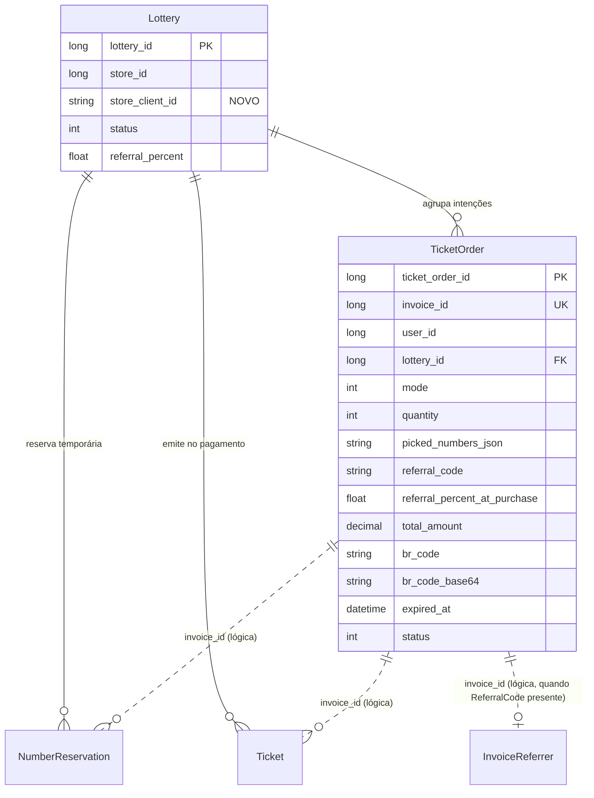

# Data Model — Compra de Ticket via QR Code PIX

**Phase**: 1 (design)
**Inputs**: `spec.md`, `research.md`
**Referência**: Constituição §IV (convenções PostgreSQL)

---

## Entidades afetadas nesta feature

| Entidade | Mudança |
|---|---|
| `TicketOrder` | **NOVA** — contexto da compra entre criação do QR Code e emissão de tickets |
| `Lottery` | **ALTERADA** — ganha coluna `store_client_id` (cache do `clientId` ProxyPay por Store) |
| `NumberReservation` | **ALTERADA** — coluna `invoice_id` passa a referenciar `TicketOrder.InvoiceId` (lógica, não FK) |
| `Ticket` | **ALTERADA** — coluna `invoice_id` passa a referenciar `TicketOrder.InvoiceId` (lógica, não FK) |
| `InvoiceReferrer` | inalterada (estrutura) — criada por `ProcessPaymentAsync` a partir do `TicketOrder.ReferralCode` |
| `WebhookEvent` | **DEPRECIADA** — tabela fica, ninguém insere mais |

---

## 1. TicketOrder (NOVA)

### Propósito

Persistir a intenção de compra no momento em que o QR Code é gerado, para que `TicketService.ProcessPaymentAsync(invoiceId)` tenha todo o contexto (modo, números escolhidos, comprador, código de indicação, snapshot de `ReferralPercent`) sem depender de metadata do provedor.

### C# Model (`Fortuno.Domain/Models/TicketOrder.cs`)

```csharp
public class TicketOrder
{
    public long TicketOrderId { get; set; }
    public long InvoiceId { get; set; }              // retornado pelo ProxyPay; único
    public string InvoiceNumber { get; set; } = string.Empty;
    public long UserId { get; set; }                 // NAuth user id do comprador
    public long LotteryId { get; set; }
    public int Quantity { get; set; }
    public TicketOrderMode Mode { get; set; } // enum existente (Random | UserPicks)
    public string? PickedNumbersJson { get; set; }   // JSON de long[], só quando Mode=UserPicks
    public string? ReferralCode { get; set; }        // copiado do request (opcional)
    public float ReferralPercentAtPurchase { get; set; } // snapshot do Lottery.ReferralPercent
    public decimal TotalAmount { get; set; }
    public string? BrCode { get; set; }              // cache da resposta do provedor (para reexibir em Pending)
    public string? BrCodeBase64 { get; set; }
    public DateTime ExpiredAt { get; set; }          // do provedor
    public TicketOrderStatus Status { get; set; } // Pending=1, Paid=2, Expired=3, Cancelled=4
    public DateTime CreatedAt { get; set; }
    public DateTime UpdatedAt { get; set; }

    public Lottery Lottery { get; set; } = null!;
}

public enum TicketOrderStatus
{
    Pending = 1,
    Paid = 2,
    Expired = 3,
    Cancelled = 4
}
```

### Tabela PostgreSQL (`fortuna_ticket_orders`)

```sql
CREATE TABLE fortuna_ticket_orders (
    ticket_order_id           bigint GENERATED BY DEFAULT AS IDENTITY NOT NULL,
    invoice_id                   bigint NOT NULL,
    invoice_number               varchar(40) NOT NULL,
    user_id                      bigint NOT NULL,
    lottery_id                   bigint NOT NULL,
    quantity                     int NOT NULL,
    mode                         int NOT NULL,                          -- TicketOrderMode
    picked_numbers_json          varchar(4000) NULL,                    -- JSON de long[]
    referral_code                varchar(8) NULL,
    referral_percent_at_purchase real NOT NULL DEFAULT 0,
    total_amount                 numeric(14,2) NOT NULL,
    br_code                      varchar(2000) NULL,
    br_code_base64               text NULL,
    expired_at                   timestamp without time zone NOT NULL,
    status                       int NOT NULL DEFAULT 1,                -- Pending
    created_at                   timestamp without time zone NOT NULL DEFAULT now(),
    updated_at                   timestamp without time zone NOT NULL DEFAULT now(),
    CONSTRAINT fortuna_ticket_orders_pkey PRIMARY KEY (ticket_order_id),
    CONSTRAINT fk_ticket_order_lottery FOREIGN KEY (lottery_id)
        REFERENCES fortuna_lotteries (lottery_id) ON DELETE SET NULL
);

CREATE UNIQUE INDEX ix_ticket_orders_invoice_id
    ON fortuna_ticket_orders (invoice_id);

CREATE INDEX ix_ticket_orders_user_id
    ON fortuna_ticket_orders (user_id);

CREATE INDEX ix_ticket_orders_lottery_id
    ON fortuna_ticket_orders (lottery_id);
```

### Fluent API (`Fortuno.Infra/Context/FortunoContext.cs`)

```csharp
modelBuilder.Entity<TicketOrder>(e =>
{
    e.ToTable("fortuna_ticket_orders");
    e.HasKey(x => x.TicketOrderId).HasName("fortuna_ticket_orders_pkey");
    e.Property(x => x.TicketOrderId).HasColumnName("ticket_order_id").ValueGeneratedOnAdd();
    e.Property(x => x.InvoiceId).HasColumnName("invoice_id").IsRequired();
    e.Property(x => x.InvoiceNumber).HasColumnName("invoice_number").HasColumnType("varchar(40)").IsRequired();
    e.Property(x => x.UserId).HasColumnName("user_id").IsRequired();
    e.Property(x => x.LotteryId).HasColumnName("lottery_id").IsRequired();
    e.Property(x => x.Quantity).HasColumnName("quantity").IsRequired();
    e.Property(x => x.Mode).HasColumnName("mode").HasConversion<int>().IsRequired();
    e.Property(x => x.PickedNumbersJson).HasColumnName("picked_numbers_json").HasColumnType("varchar(4000)");
    e.Property(x => x.ReferralCode).HasColumnName("referral_code").HasColumnType("varchar(8)");
    e.Property(x => x.ReferralPercentAtPurchase).HasColumnName("referral_percent_at_purchase").HasColumnType("real").IsRequired();
    e.Property(x => x.TotalAmount).HasColumnName("total_amount").HasColumnType("numeric(14,2)").IsRequired();
    e.Property(x => x.BrCode).HasColumnName("br_code").HasColumnType("varchar(2000)");
    e.Property(x => x.BrCodeBase64).HasColumnName("br_code_base64").HasColumnType("text");
    e.Property(x => x.ExpiredAt).HasColumnName("expired_at").HasColumnType("timestamp without time zone").IsRequired();
    e.Property(x => x.Status).HasColumnName("status").HasConversion<int>().IsRequired().HasDefaultValue(TicketOrderStatus.Pending);
    e.Property(x => x.CreatedAt).HasColumnName("created_at").HasColumnType("timestamp without time zone").HasDefaultValueSql("now()");
    e.Property(x => x.UpdatedAt).HasColumnName("updated_at").HasColumnType("timestamp without time zone").HasDefaultValueSql("now()");

    e.HasIndex(x => x.InvoiceId).IsUnique().HasDatabaseName("ix_ticket_orders_invoice_id");
    e.HasIndex(x => x.UserId).HasDatabaseName("ix_ticket_orders_user_id");
    e.HasIndex(x => x.LotteryId).HasDatabaseName("ix_ticket_orders_lottery_id");

    e.HasOne(x => x.Lottery)
     .WithMany()
     .HasForeignKey(x => x.LotteryId)
     .OnDelete(DeleteBehavior.ClientSetNull)
     .HasConstraintName("fk_ticket_order_lottery");
});
```

### Validation Rules

| Campo | Regra |
|---|---|
| `InvoiceId` | `> 0`, único |
| `InvoiceNumber` | não vazio, ≤ 40 chars |
| `UserId` | `> 0` |
| `LotteryId` | `> 0`, referencia Lottery existente |
| `Quantity` | `> 0`, dentro de `Lottery.TicketMin/TicketMax` |
| `Mode` | válido no enum `TicketOrderMode` |
| `PickedNumbersJson` | obrigatório quando `Mode == UserPicks`; JSON array de long |
| `ReferralCode` | ≤ 8 chars, `[A-Z0-9]*` quando presente |
| `ReferralPercentAtPurchase` | ∈ [0, 100] |
| `TotalAmount` | `> 0`, bate com `Quantity * Lottery.TicketPrice - combo discount` |
| `ExpiredAt` | `> CreatedAt` |
| `Status` | transições permitidas: `Pending → Paid`, `Pending → Expired`, `Pending → Cancelled` (terminais) |

### Máquina de estado

```text
  created
    │
    ▼
 ┌─────────┐
 │ Pending │◄── estado inicial (default do DB)
 └────┬────┘
      │
      ├── polling: provedor retorna "paid" + Lottery Open + pool OK / reservas OK
      │     ▼
      │  ┌──────┐
      │  │ Paid │  (terminal — tickets emitidos, InvoiceReferrer registrado)
      │  └──────┘
      │
      ├── polling: provedor retorna "expired" OU ExpiredAt < now sem Paid
      │     ▼
      │  ┌─────────┐
      │  │ Expired │  (terminal — reservas UserPicks expiram por TTL lazy)
      │  └─────────┘
      │
      └── polling: provedor retorna "cancelled"
            ▼
         ┌───────────┐
         │ Cancelled │  (terminal)
         └───────────┘

  Transições proibidas:
  - Paid → qualquer outro
  - Expired → Paid
  - Cancelled → qualquer outro
```

Todas as transições para `Paid`, `Expired` e `Cancelled` fazem `SET updated_at = now()` e são **condicionais** (`WHERE status = 1`) — garante idempotência sob concorrência (R-002).

### Operações do Repository (`ITicketOrderRepository`)

```csharp
public interface ITicketOrderRepository : IRepository<TicketOrder>
{
    Task<TicketOrder?> GetByInvoiceIdAsync(long invoiceId);
    Task<int> TryMarkPaidAsync(long purchaseIntentId);        // UPDATE ... WHERE status = 1
    Task<int> TryMarkExpiredAsync(long purchaseIntentId);
    Task<int> TryMarkCancelledAsync(long purchaseIntentId);
}
```

O `IRepository<T>` base já tem `InsertAsync`, `UpdateAsync`, `GetByIdAsync`, `ListAsync` — seguir convenção.

---

## 2. Lottery (ALTERADA — 1 coluna nova)

### Mudança

Adicionar coluna `store_client_id` em `fortuna_lotteries` para cachear o `clientId` do ProxyPay da Store dona da Lottery (R-004).

### SQL

```sql
ALTER TABLE fortuna_lotteries
    ADD COLUMN store_client_id varchar(64) NULL;
```

### C# Model (`Fortuno.Domain/Models/Lottery.cs`)

Adicionar propriedade:

```csharp
public string? StoreClientId { get; set; }
```

### Fluent API — adicionar à configuração existente

```csharp
e.Property(x => x.StoreClientId).HasColumnName("store_client_id").HasColumnType("varchar(64)");
```

### Populado por

`LotteryService.CreateAsync` após chamada a `_proxyPay.GetStoreAsync(dto.StoreId)`:

```csharp
var store = await _proxyPay.GetStoreAsync(dto.StoreId)
    ?? throw new KeyNotFoundException("Store não encontrada no ProxyPay.");
entity.StoreClientId = store.ClientId;
```

### Retrocompatibilidade

Coluna é `NULL` para Lotteries já existentes. `TicketService.CreateQRCodeAsync` valida:

```csharp
if (string.IsNullOrWhiteSpace(lottery.StoreClientId))
    throw new InvalidOperationException(
        "Lottery criada antes da integração com ProxyPay QR Code. Recrie a Lottery ou atualize o StoreClientId manualmente.");
```

### Mudança correlata em `ProxyPayStoreInfo` (`Fortuno.DTO/ProxyPay/ProxyPayStoreInfo.cs`)

Adicionar `ClientId`:

```csharp
public class ProxyPayStoreInfo
{
    public long StoreId { get; set; }
    public long OwnerUserId { get; set; }
    public string Name { get; set; } = string.Empty;
    public string ClientId { get; set; } = string.Empty;  // NOVO
}
```

E atualizar a query `myStore` do `ProxyPayAppService.GetStoreAsync`:

```csharp
var query = "{ myStore { storeId userId clientId name } }";
```

---

## 3. NumberReservation (ALTERADA — semântica)

### Mudança

Zero DDL. A coluna `invoice_id` continua existindo (já usada no fluxo atual). O que muda é a **origem** do valor: antes, era escrito após a criação do invoice pelo `PurchaseService.ConfirmAsync`. Agora é escrito pelo `TicketService.CreateQRCodeAsync` logo após receber o `invoiceId` do `POST /payment/qrcode`.

### Consulta de liberação lazy

Toda consulta que hoje usa `ListActiveReservedNumbersAsync(lotteryId)` **deve** filtrar por `ExpiresAt > now` (sem alteração de método, apenas confirmar que a implementação atual já faz). Se não filtra, ajustar. FR-024.

---

## 4. Ticket (inalterada)

O ticket continua sendo emitido por inserção em `fortuna_tickets` via `_ticketRepo.InsertBatchAsync`, agora dentro de `TicketService.ProcessPaymentAsync`. A coluna `invoice_id` da tabela referencia o mesmo `InvoiceId` do `TicketOrder`.

Índice recomendado (se não existir): `ix_tickets_invoice_id` em `fortuna_tickets.invoice_id` para a reconciliação do R-002 ser O(1).

Verificar migration existente; adicionar se ausente:

```sql
CREATE INDEX IF NOT EXISTS ix_tickets_invoice_id
    ON fortuna_tickets (invoice_id);
```

---

## 5. InvoiceReferrer (inalterada)

Estrutura preservada. Criação migra do `PurchaseService.ProcessPaidWebhookAsync` para `TicketService.ProcessPaymentAsync` (dentro da transação do passo 6 em R-002).

---

## 6. WebhookEvent (DEPRECIADA)

Tabela permanece por compatibilidade histórica. Nenhum escrita nova. A limpeza (drop) fica para feature posterior — fora do escopo desta.

---

## Diagrama de relações (ER simplificado)



---

## Impacto nos testes

- `TicketOrderRepositoryTests` — NOVO: inserção, `GetByInvoiceIdAsync`, `TryMarkPaidAsync` (pathpositivo + corrida).
- `TicketServiceTests` — EXPANDE com cenários de `CreateQRCodeAsync`, `CheckQRCodeStatusAsync`, `ProcessPaymentAsync`.
- `LotteryServiceTests` — AJUSTA: `CreateAsync` agora popula `StoreClientId`; mock de `IProxyPayAppService.GetStoreAsync` deve devolver `ProxyPayStoreInfo` com `ClientId` preenchido.
- `ProxyPayAppServiceTests` — REESCREVE: `GetStoreAsync` devolve `clientId`; novos testes para `CreateQRCodeAsync` e `GetQRCodeStatusAsync`.
